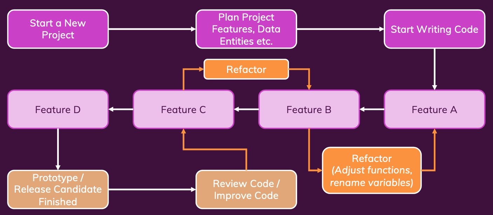

<details>
  <summary>Table of Contents</summary>
  <ol>
    <li><a href="#about-the-project">About The Project</a></li>
    <li><a href="#introduction">Introduction</a></li>
    <li><a href="#naming">Naming</a></li>
    <li><a href="#code-structure-comments--formatting">Code Structure, Comments & Formatting</a></li>
  </ol>
</details>

&nbsp;

## About The Project

- Clean Code
- Learn how to write readable, understandable and therefore maintainable code - step by step, in an example-driven way
- [Original Repo: academind/clean-code-course-code](https://github.com/academind/clean-code-course-code)
- [Maximilian Schwarzmüller](https://github.com/maxschwarzmueller)
- [Academind](https://academind.com/)

&nbsp;

---

&nbsp;

## Introduction

- **What is clean code?**
  - Should be readable and meaningful
  - Should reduce cognitive load
  - Should be concise and “to the point”
  - Should avoid unintuitive names, complex nesting and big code blocks
  - Should follow common best practices and patterns
  - Should be fun to write and to maintain
- **Key Pain Points**
  - Names
    - Variables
    - Functions
    - Classes
  - Formatting & Comments
    - Code Formatting
    - Good & Bad Comments
  - Functions
    - Length
    - Parameters
  - Conditionals & Error Handling
    - Deep Nesting
    - Missing Error Handling
  - Classes & Objects
    - Missing Distinction
    - Bloated Classes
  - Solutions
    - Rules & Concepts
    - Patterns & Principles
    - Test-Driven Development
- **Clean code is written over time**
  - Start from the beginning (Iterative process)
  - You will always find ways of improving your code
  - As your project evolves and changes, your code will need to change
  - Question old code and refactor a lot!
- **Embrace Refactoring**
  - Refactoring today is work you save tomorrow
  - A codebase can only survive and stay maintainable if it’s continuously improved and refactored
  - Pro tip: Whenever you add something new, try to improve existing code along the way



&nbsp;

---

&nbsp;

## Naming

- Names should be **meaningful**

```ts
const us = new MainEntity();
us.process();

if (login) {
  // ...
}

/* ************************ */
/*            VS            */
/* ************************ */

class User {
  save() {}
}

const isLoggedIn = true;

const user = new User();
user.save();

if (isLoggedIn) {
  // ...
}
```

- **How To Name Things Correctly**
  - Variables & Constants
    - Data containers
    - e.g. user input data, validation results, a list of products
    - Use **nouns** or short phrases with **adjectives**
    - `const userData = { ... }`
    - `const isValid = ..`
  - Functions / Methods
    - Commands or calculated values
    - e.g. send data to server, check if user input is valid
    - Use **verbs** or short phrases with **adjectives**
    - `sendData()`
    - `inputIsValid()`
  - Classes
    - Use classes to create “things”
    - e.g. a user, a product, a http request body
    - Use **nouns** or short phrases with **nouns**
    - `class User { ... }`
    - `class RequestBody { ... }`
- **Name Casing**
  - snake_case
    - Python
    - Variables, functions & methods
  - camelCase
    - Java & JavaScript
    - Variables, functions & methods
  - PascalCase
    - Python, Java & JavaScript
    - Classes
  - kebab-case
    - HTML Elements
- **Exception**
  - Libraries
  - getters & setters

```py
from datetime import datetime

class DateUtil:
    @staticmethod
    def get_formatted_today():
        date_today = datetime.now()
        formatted_date = date_today.strftime('%Y-%m-%d')
        return formatted_date


print(DateUtil.get_formatted_today())
```

```ts
class Database {
  private client: any;

  get connectedClient() {
    if (!this.client) {
      throw new Error('Database not connected!');
    }
    return this.client;
  }

  connect() {
    // Establishing connection ...
    this.client = {};
  }
}

const db = new Database();
db.connectedClient.query();
```

- Don’t include redundant information in names
- Avoid slang, unclear abbreviations & disinformation
- Choose distinctive names
- Be consistent

&nbsp;

---

&nbsp;

> **David:** When we are creating new functions related to a Model (for example, Controllers relating the CRUD of a Model) should we use verb + model or model + verb?
>
> For example, which option is better?
>
> 1. `updatePost`, `createPost` & `deletePost`
> 2. `postUpdate`, `postCreate` & `postDelete`
>
> Option 1 sounds better, but option 2 makes it easier to find, as we only need to search for functions starting with the name of the model ('post'). So, going back to the question: Verb + Model or Model + Verb?

> **Maximilian:** As so often, this in the end of course also comes down to personal preferences and conventions in your team (or often also for specific frameworks you might be working with).
>
> I personally typically prefer 1) since I would say that it conveys more meaning but if you're working with a framework technology where 2) is the convention, I would go with that.

&nbsp;

---

&nbsp;

## Code Structure, Comments & Formatting

- **Bad Comment**
  - Redundant Information
  - Dividers / Block Markers
  - Misleading Comments
  - Commented-Out Code
- **Good Comment**
  - Legal Information
  - Explanations which can’t be replaced by good naming
  - Warnings
  - Todo Notes
  - Documentation Strings
- **Code Formatting Improves Readability & Transports Meaning**
  - **Vertical Formatting**
    - Space between Lines
    - Grouping of Code
    - **Code should be readable like an essay – top to bottom without too many “jumps”**
      - Consider splitting files with multiple concepts (e.g. classes) into multiple files
      - Different concepts (“areas”) should be separated by spacing
      - Similar concepts (“areas”) should not be separated by spacing
      - Related concepts should be kept close to each other
  - **Horizontal Formatting**
    - Indentation
    - Space between Code
    - Line Width
    - Lines of code should be readable without scrolling – avoid very long “sentences”
      - Use indentation – even if not required technically
      - Break long statements into multiple shorter ones
      - Use clear but not unreadable long names
  - Formatting is important and greatly improves readability
  - Formatting rules differ between languages
  - Follow language-specific conventions and guidelines

&nbsp;

---

&nbsp;
