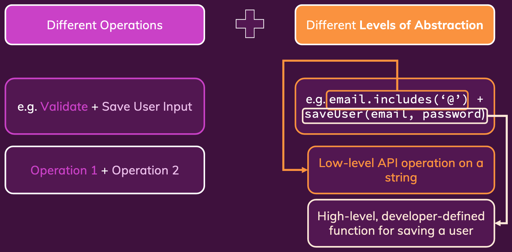
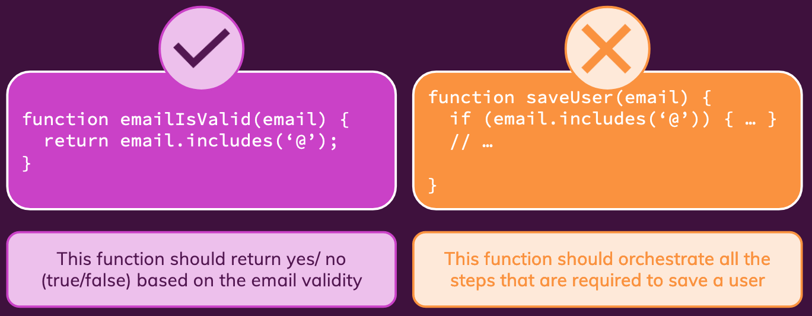
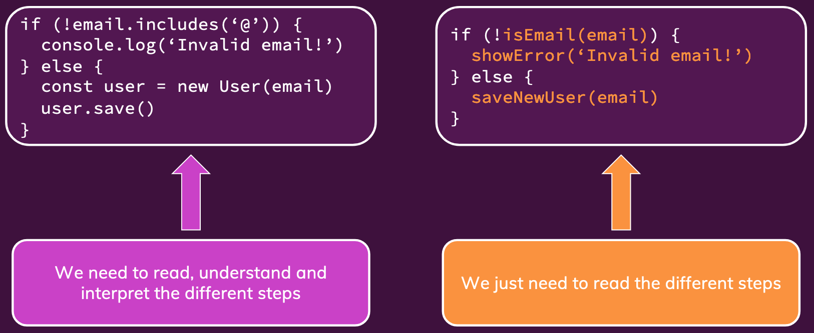
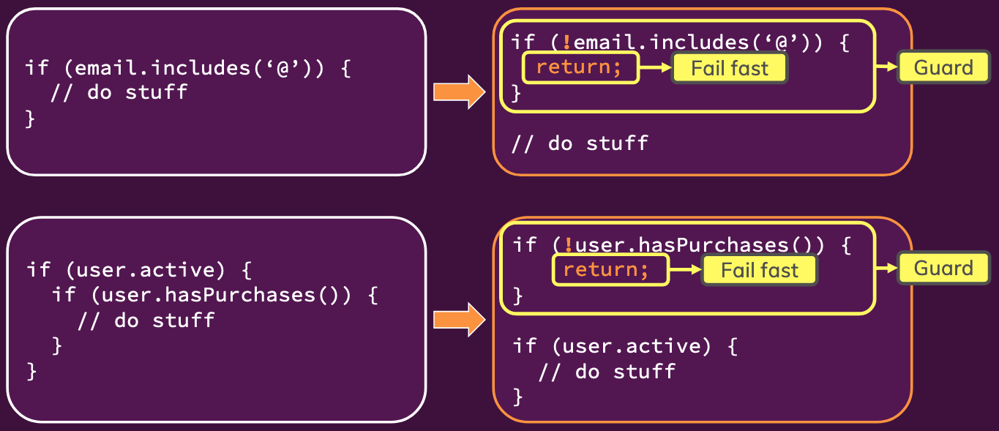

<details>
  <summary>Table of Contents</summary>
  <ol>
    <li><a href="#about-the-project">About The Project</a></li>
    <li><a href="#introduction">Introduction</a></li>
    <li><a href="#naming">Naming</a></li>
    <li><a href="#code-structure-comments--formatting">Code Structure, Comments & Formatting</a></li>
    <li><a href="#functions--methods">Functions & Methods</a></li>
    <li><a href="#control-structures--errors">Control Structures & Errors</a></li>
  </ol>
</details>

&nbsp;

## About The Project

- Clean Code
- Learn how to write readable, understandable and therefore maintainable code - step by step, in an example-driven way
- [Original Repo: academind/clean-code-course-code](https://github.com/academind/clean-code-course-code)
- [Maximilian Schwarzmüller](https://github.com/maxschwarzmueller)
- [Academind](https://academind.com/)

&nbsp;

---

&nbsp;

## Introduction

- **What is clean code?**
  - Should be readable and meaningful
  - Should reduce cognitive load
  - Should be concise and “to the point”
  - Should avoid unintuitive names, complex nesting and big code blocks
  - Should follow common best practices and patterns
  - Should be fun to write and to maintain
- **Key Pain Points**
  - Names
    - Variables
    - Functions
    - Classes
  - Formatting & Comments
    - Code Formatting
    - Good & Bad Comments
  - Functions
    - Length
    - Parameters
  - Conditionals & Error Handling
    - Deep Nesting
    - Missing Error Handling
  - Classes & Objects
    - Missing Distinction
    - Bloated Classes
  - Solutions
    - Rules & Concepts
    - Patterns & Principles
    - Test-Driven Development
- **Clean code is written over time**
  - Start from the beginning (Iterative process)
  - You will always find ways of improving your code
  - As your project evolves and changes, your code will need to change
  - Question old code and refactor a lot!
- **Embrace Refactoring**
  - Refactoring today is work you save tomorrow
  - A codebase can only survive and stay maintainable if it’s continuously improved and refactored
  - Pro tip: Whenever you add something new, try to improve existing code along the way


&nbsp;

---

&nbsp;

## Naming

- Names should be **meaningful**

```ts
const us = new MainEntity();
us.process();

if (login) {
  // ...
}

/* ************************ */
/*            VS            */
/* ************************ */

class User {
  save() {}
}

const isLoggedIn = true;

const user = new User();
user.save();

if (isLoggedIn) {
  // ...
}
```

- **How To Name Things Correctly**
  - Variables & Constants
    - Data containers
    - e.g. user input data, validation results, a list of products
    - Use **nouns** or short phrases with **adjectives**
    - `const userData = { ... }`
    - `const isValid = ..`
  - Functions / Methods
    - Commands or calculated values
    - e.g. send data to server, check if user input is valid
    - Use **verbs** or short phrases with **adjectives**
    - `sendData()`
    - `inputIsValid()`
  - Classes
    - Use classes to create “things”
    - e.g. a user, a product, a http request body
    - Use **nouns** or short phrases with **nouns**
    - `class User { ... }`
    - `class RequestBody { ... }`
- **Name Casing**
  - snake_case
    - Python
    - Variables, functions & methods
  - camelCase
    - Java & JavaScript
    - Variables, functions & methods
  - PascalCase
    - Python, Java & JavaScript
    - Classes
  - kebab-case
    - HTML Elements
- **Exception**
  - Libraries
  - getters & setters

```py
from datetime import datetime

class DateUtil:
    @staticmethod
    def get_formatted_today():
        date_today = datetime.now()
        formatted_date = date_today.strftime('%Y-%m-%d')
        return formatted_date


print(DateUtil.get_formatted_today())
```

```ts
class Database {
  private client: any;

  get connectedClient() {
    if (!this.client) {
      throw new Error('Database not connected!');
    }
    return this.client;
  }

  connect() {
    // Establishing connection ...
    this.client = {};
  }
}

const db = new Database();
db.connectedClient.query();
```

- Don’t include redundant information in names
- Avoid slang, unclear abbreviations & disinformation
- Choose distinctive names
- Be consistent

&nbsp;

---

&nbsp;

> **David:** When we are creating new functions related to a Model (for example, Controllers relating the CRUD of a Model) should we use verb + model or model + verb?
>
> For example, which option is better?
>
> 1. `updatePost`, `createPost` & `deletePost`
> 2. `postUpdate`, `postCreate` & `postDelete`
>
> Option 1 sounds better, but option 2 makes it easier to find, as we only need to search for functions starting with the name of the model ('post'). So, going back to the question: Verb + Model or Model + Verb?

> **Maximilian:** As so often, this in the end of course also comes down to personal preferences and conventions in your team (or often also for specific frameworks you might be working with).
>
> I personally typically prefer 1) since I would say that it conveys more meaning but if you're working with a framework technology where 2) is the convention, I would go with that.

&nbsp;

---

&nbsp;

## Code Structure, Comments & Formatting

- **Bad Comment**
  - Redundant Information
  - Dividers / Block Markers
  - Misleading Comments
  - Commented-Out Code
- **Good Comment**
  - Legal Information
  - Explanations which can’t be replaced by good naming
  - Warnings
  - Todo Notes
  - Documentation Strings
- **Code Formatting Improves Readability & Transports Meaning**
  - **Vertical Formatting**
    - Space between Lines
    - Grouping of Code
    - **Code should be readable like an essay – top to bottom without too many “jumps”**
      - Consider splitting files with multiple concepts (e.g. classes) into multiple files
      - Different concepts (“areas”) should be separated by spacing
      - Similar concepts (“areas”) should not be separated by spacing
      - Related concepts should be kept close to each other
  - **Horizontal Formatting**
    - Indentation
    - Space between Code
    - Line Width
    - Lines of code should be readable without scrolling – avoid very long “sentences”
      - Use indentation – even if not required technically
      - Break long statements into multiple shorter ones
      - Use clear but not unreadable long names
  - Formatting is important and greatly improves readability
  - Formatting rules differ between languages
  - Follow language-specific conventions and guidelines

&nbsp;

---

&nbsp;

## Functions & Methods

- The number and order of arguments matter
- The length of the function body matters
- Minimize the number of parameters

&nbsp;

---

&nbsp;

> **Paulo:** Is packing values to avoid multiple arguments in a function really a good practice?
>
> In this lesson, when dealing with functions with 3+ arguments, you advise packing multiple arguments into an object or dictionary. I would argue that it does indeed make it easier to read. But it makes it harder to write or reuse that function in the future. Typically modern IDEs will show the function's arguments name, so it's not as dramatic of a problem and you present it.
>
> Figuring out the order typically does not require diving into the function code (assuming they are well named). It can have some impact on reading, depending on the context, but it makes it easier to write.
> ?
> But using a dictionary or (IMO worse) creating a class for the specific purpose of passing data just adds Boilerplate code, and requires you to dive into that function code to see what object data / dictionary keys that function expects. If a user class is used globally then yeah it makes sense to pass a user object, even if you only need part of the data. That can be offloaded to the function.
>
> I'm not saying it's wrong advice, more that this is a tradeoff. Easy to read vs Easy to write (and reuse). A function used once vs a function used everywhere.

&nbsp;

---

&nbsp;

- **Output Parameters**
  - `createId(user)`: Not great – user gets modified in an unexpected way
  - `addId(user)`: Okay – user gets modified, but the function implies it
  - `user.addId()`: Great – it’s obvious, that the user will get modified
- **Functions should be small**
- **Functions should do exactly one thing**
  - **What Is “One Thing”?** Different Operations + Different Levels of Abstraction
  - Understanding “Levels of Abstraction”
    - **High Level**
      - `isEmail(email)`
      - We don’t control how the email is validated – we just want it to be validated
      - This is easy to read – there is no room for interpretation
    - **Low Level**
      - `email.includes(‘@’)`
      - We control how the email is validated
      - This might be technically clear, but the interpretation must be added by the reader



- **Functions & Abstraction**
  - Functions should do work that’s one level of abstraction below their name
    
  - Try not to mix levels of abstraction
    

&nbsp;

- **Keeping functions short**
  - Rule of Thumb
    - Extract code that works on the same functionality
    - Extract code that requires more interpretation than the surrounding code


- **Reusability Matters (Sometimes)**
- **DRY (Don’t Repeat Yourself)**
- **Use Common Sense**
- **Split Functions Reasonably**
  - Make reasonable decisions and don’t split if
    - you’re just renaming the operation
    - finding the new function will take longer than reading the extracted code
    - can’t produce a reasonable name for the extracted function
- **Try Keeping Functions Pure**
  - Input (Parameters) -> Output (Return value)
  - The same input always yields the same output
  - **No side effects**
    - 
    - A **side effect** is an operation which does not just act on function inputs and **change the function output but which instead changes the overall system/ program state**
    - Side effects are not automatically bad – we do need them in our programs. But **unexpected side effects should be avoided**.
  - **Avoid unexpected side effects**
    - Naming matters!
    - The name of a function should signal or imply that a side effect is likely to occur
      - `saveUser(...)`: Side effect expected
      - `isValid(...)`: Side effect not expected
      - `showMessage(...)`: Side effect expected
      - `createUser(...)`: Side effect not necessarily expected
  - **Handling side effects**
    - If you have/ need a side effect
      - Choose a function name which implies it
      - Move the side effect into another function/ place
- **Can you easily test a function?**
  - Yes: Great!
  - No: Consider splitting it

&nbsp;

---

&nbsp;

## Control Structures & Errors

- **Avoid Deep Nesting**
  - Using Factory Functions & Polymorphism
  - Utilize Errors
- **Prefer Positive Checks** (`if isEmpty` vs `if isNotEmpty`)
- **Use Guards & Fail Fast**



- **Embrace Errors & Error Handling**
  - Throwing + handling errors can replace if statements and lead to more focused functions
  - Simple rule: If something is an error -> Make it an error
  - Error Handling is “One Thing”!

```js
if (!isEmail) return {code: 422, message: ‘Invalid input’};

/* ********************************************* */

if (!isEmail) {
  const error = new Error(‘Invalid input’);
  error.code = 422;
  throw error;
}
```

&nbsp;

---

&nbsp;

> **Stefano:** Try/catch approach & performances
>
> I see the benefits on the cleanliness of the code of the error throwing approach, but what about the performances?
> Does this impact on them and how in javascript, since we are talking about it in this lesson?
> Isn't it too costly compared with dealing with errors via if, maybe at the price of slightly less readable code?

> **Maximilian:** I guess this is hard to answer in a general way for all programming languages since I really don't know it for all programming languages.
>
> For the languages I work with (mostly JavaScript, Python), I am not aware of considerable performance costs.
> You might definitely find that throwing and handling errors is "slower" / more performance-intensive than using conditions.
> BUT the question is if that really will have an impact.
> Not using errors could be a micro-optimization which does not matter in the overall app but still comes with the downside of less readable code.

> **Benjamin James:** I just did a quick skim across the web and it looks like Error Handling is generally discouraged for control flow because it is often ~1000% slower depending on your implementation (even if you skip unwinding the stack), and introduces corner cases at very low levels of code that requires deep nesting to be handled correctly (and therefore reduces readability).
>
> It seems that this might be ok for high-level code with few performance restrictions, but should be avoided in low level code where performance is important (e.g. C has limited exception handling anyways)

&nbsp;

---

&nbsp;
